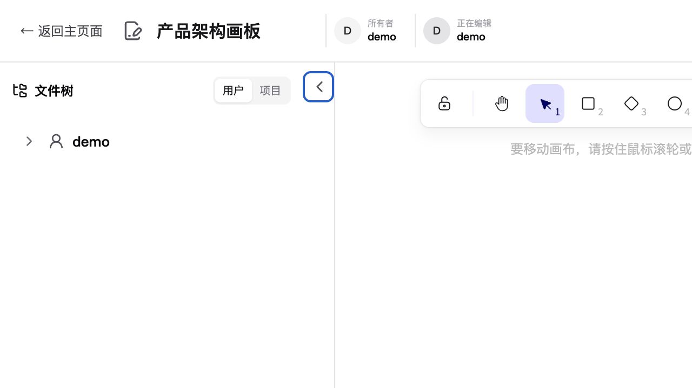
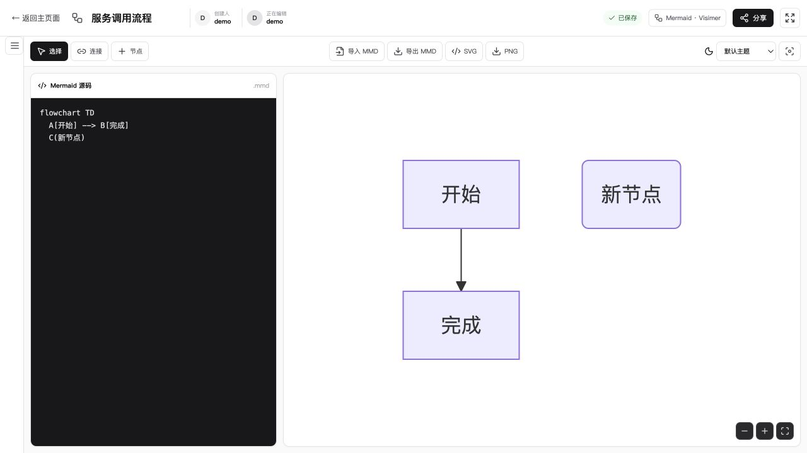

# Super Graph

Super Graph 是面向可信公司内网的轻量图表协作与分享服务，在一个工作台中同时提供 Excalidraw 自由画板和 Mermaid/Visimer 结构化图表编辑器。

生产部署只需要一个 Go 可执行文件。React 前端、Excalidraw、Mermaid、Visimer 和浏览器端图片渲染能力都通过 `go:embed` 内置，不需要 Docker、Node.js、Chromium、Redis 或独立协作服务。

## 功能截图

### Excalidraw 实时协作画板



### Mermaid + Visimer 可视化编辑器



## 项目优势

- **真正的单二进制部署**：前端、REST API、WebSocket 协作和 SQLite 存储全部由一个 Go 进程提供。
- **两种互补画板**：Excalidraw 适合自由绘制和多人讨论；Mermaid + Visimer 适合可审查、可复制、适合 Git 的文本图表。
- **数据不锁定**：Excalidraw 可导入/导出 `.excalidraw`，Mermaid 可导入/导出 `.mmd`，并支持 SVG、PNG 和 Markdown 分享。
- **共享链接始终稳定**：`/image/{drawingID}.png` 始终指向最新图片；文件或图片不存在时返回“图片已被删除”占位图，而不是破损链接。
- **适合内部知识管理**：用户空间、项目空间、无限级目录、创建/修改人和时间信息集中展示。
- **低运维成本**：首次运行自动创建配置、数据目录和日志目录，日志按配置自动老化。
- **浏览器负责渲染**：Go 服务端不承担 Excalidraw 或 Mermaid 布局渲染；Mermaid PNG 使用浏览器内 WASM 生成。
- **跨平台发布**：GitHub Actions 自动打包 Windows AMD64、Linux AMD64/ARM64 和 macOS ARM64。

## 核心功能

- 用户名直接登录和 SQLite session cookie
- 用户空间、项目空间与多级文件树
- 项目、目录和文件的创建、重命名与安全删除
- 文件创建时间、最近修改时间、创建人和最近修改人
- 日活、近 30 日活跃、GitHub 风格年度活跃热力图和文件数量排行
- Excalidraw 元素、图片、光标、选择和在线成员的 Yjs 实时协作
- Mermaid 源码和 Visimer WYSIWYG 画布双向同步
- Excalidraw、MMD、SVG、PNG、Markdown 和协作链接导入导出
- 浏览器端周期自动保存和动态 PNG 更新
- 编辑页文件树、全屏、主题、背景颜色、Library 和分享工具
- shadcn 风格的中性界面与 Lucide 图标

## 构建

开发机需要 Go 1.25+ 和 Node.js 20+。Node.js 只在构建前端时使用。

```bash
make build
```

产物为：

```text
dist/super-graph
```

构建使用 `CGO_ENABLED=0`，生产机器不需要额外运行时。

### Windows PowerShell 构建

在 Windows PowerShell 5.1 或 PowerShell 7 中运行：

```powershell
Set-ExecutionPolicy -Scope Process Bypass
.\scripts\build.ps1
```

默认生成 `dist\super-graph-windows-amd64.exe`。也可以构建 Windows ARM64，或指定输出位置：

```powershell
.\scripts\build.ps1 -Architecture arm64
.\scripts\build.ps1 -OutputPath .\dist\super-graph.exe
```

## 启动

无需指定端口或数据目录：

```bash
./super-graph
```

第一次启动会在可执行文件同级目录自动生成：

```text
.s-graph/
├── config.json
├── data/
│   ├── app.db
│   ├── collaboration.db
│   └── images/
└── logs/
    └── super-graph-YYYY-MM-DD.log
```

默认配置：

```json
{
  "port": 7988,
  "dataDir": ".s-graph/data",
  "logDir": ".s-graph/logs",
  "logRetentionDays": 30,
  "sessionDays": 30,
  "autosaveInterval": "3s",
  "maxUploadSize": 33554432
}
```

相对路径均以可执行文件所在目录为基准。修改配置后重启服务生效。开发或测试时可通过 `SUPER_GRAPH_CONFIG` 环境变量指定另一份配置文件。

## 开发与测试

```bash
make dev-backend
make dev-frontend
make test
```

前端开发服务器会把 `/api`、`/image` 和协作 WebSocket 代理到后端。

Windows 下可用一个 PowerShell 脚本同时启动前后端：

```powershell
Set-ExecutionPolicy -Scope Process Bypass
.\scripts\dev.ps1
```

脚本会在首次运行时安装前端依赖，后端配置默认写入项目目录的 `.s-graph\config.json`。按 `Ctrl+C` 会同时停止前后端进程。也可以指定开发配置：

```powershell
.\scripts\dev.ps1 -ConfigPath .\local\config.json
```

## 分享图片

编辑器“分享”弹窗支持 SVG、PNG、Markdown 和编辑链接。固定图片地址示例：

```md

```

图片 URL 不随内容编辑而改变，响应使用 `no-store`。部分第三方 Markdown 平台会使用自己的图片代理缓存，这种外部缓存不受 Super Graph 控制。

## 数据与备份

所有持久化数据位于配置文件的 `dataDir`。一致性备份建议先停止服务，再复制整个目录：

```bash
cp -a ./.s-graph/data ./.s-graph/data-backup-$(date +%Y%m%d)
```

不要只复制 `app.db` 而遗漏 WAL、协作数据库或图片目录。

## 技术架构

```text
React 18 + shadcn-style UI + Lucide
├── Excalidraw 0.17.6
│   └── y-excalidraw + Yjs + y-websocket
└── Mermaid 11 + Visimer 1.1
    └── resvg WASM browser-side PNG export
             ↕
Go single binary
├── REST / session / embedded frontend
├── ygo WebSocket collaboration
├── SQLite
└── atomic PNG files
```

Visimer 保留 Mermaid 文本作为唯一事实来源，可视化操作会转换为最小文本修改。Excalidraw 协作逻辑与普通快照自动保存相互独立，WebSocket 暂时中断时仍可继续保存最新场景。

## 安全说明

用户名直接登录只是身份标签，不提供强身份验证，仅适用于可信内网。任何人都能输入已有用户名并取得该身份；正式接入不可信网络前应替换为 SSO 或密码认证。

实现包含随机 session token、HttpOnly/SameSite cookie、同源写请求校验、WebSocket 同源校验、参数化 SQL、上传大小限制、PNG 签名检查和 owner 删除权限。部署到 HTTPS 反向代理后正确传递 `X-Forwarded-Proto: https` 时，cookie 会自动设置 `Secure`。

### 反向代理与跨站校验

如果反向代理没有保留外部 Host，写请求可能返回 `cross-site request rejected`。请让代理保留原始 Host，或同时传递外部协议与 Host：

```nginx
proxy_set_header Host $host;
proxy_set_header X-Forwarded-Proto $scheme;
proxy_set_header X-Forwarded-Host $host;
```

Super Graph 会使用 `X-Forwarded-Proto` 和 `X-Forwarded-Host` 还原浏览器看到的来源。不要通过关闭同源校验来忽略该错误，否则会降低内网站点的跨站请求防护能力。
